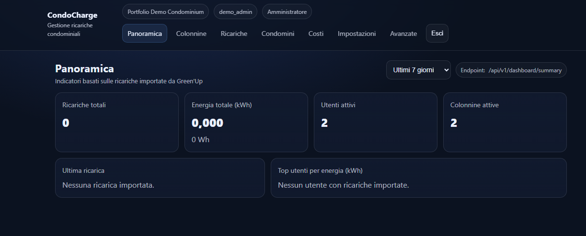
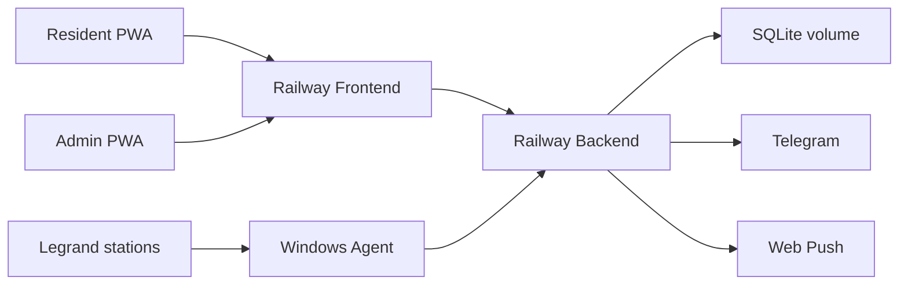
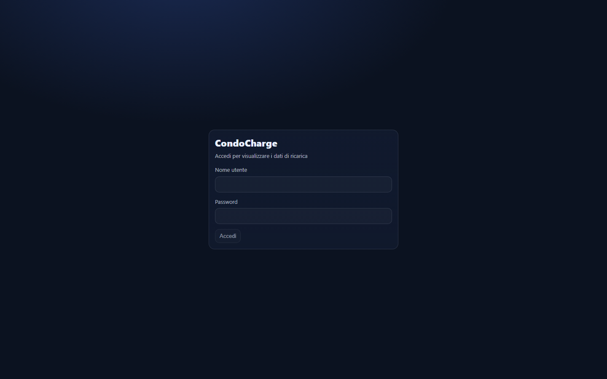
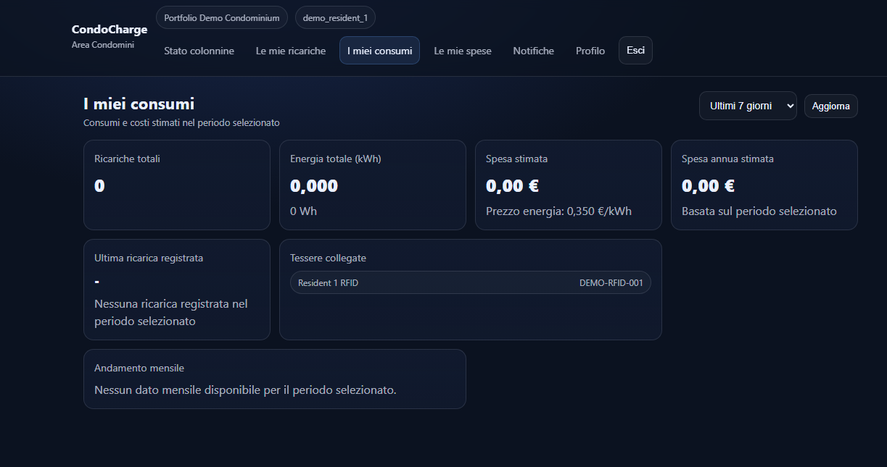
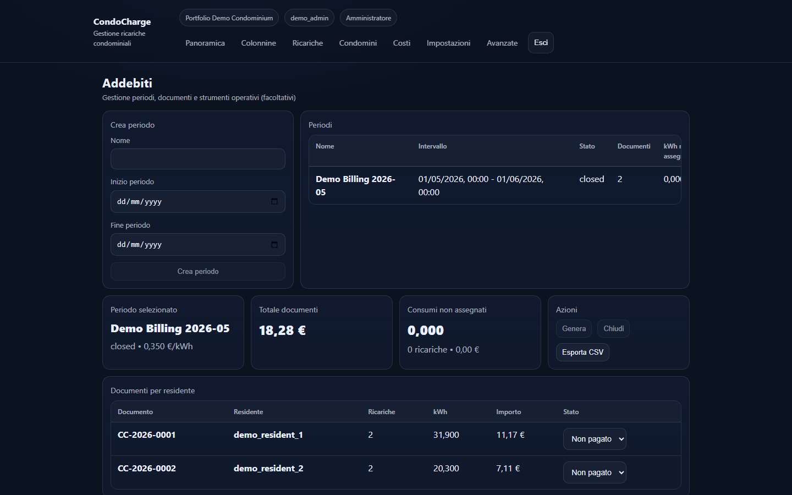

# Condo Charge

> Smart EV charging platform for condominiums

[](https://github.com/alessandroparcoacquedotti-cloud/condocharge-platform/actions/workflows/ci.yml)


**Condo Charge** e la piattaforma intelligente per la gestione della ricarica elettrica nei condomini, progettata per dare a residenti e amministratori una visione chiara, moderna e operativa del servizio.

<p align="center">
  
</p>

## Product Overview

Condo Charge non e una semplice app per vedere le colonnine.

E una piattaforma prodotto che collega infrastruttura di ricarica, monitoraggio operativo, esperienza residente e controllo amministrativo in un unico flusso coerente.

## Key Features

- Stato colonnine in tempo reale
- Notifiche Push
- Integrazione Telegram
- Storico ricariche
- Gestione RFID
- Dashboard amministratore
- Health monitoring dell'agente e della sincronizzazione
- Architettura pensata per un pilot reale in contesto condominiale

## Resident Features

- Vista mobile-first dello stato delle colonnine
- Storico delle proprie ricariche
- Notifiche di servizio tramite Push
- Comunicazioni rapide tramite Telegram
- Esperienza semplificata e focalizzata sulla disponibilita

## Admin Features

- Dashboard operativa del condominio
- Supervisione dello stato delle colonnine
- Gestione residenti e assegnazioni RFID
- Billing e riconciliazione pagamenti
- Visibilita sullo stato dell'agente e del polling
- Controllo del servizio senza dipendere da verifiche manuali

## Technical Architecture



### Architecture Notes

- `frontend/` ospita la PWA React per residenti e amministratori
- `backend/` ospita l'API FastAPI e la logica di dominio
- SQLite e usato come storage del pilot
- Un agente Windows locale effettua heartbeat e polling delle stazioni Legrand
- Telegram e Web Push estendono la comunicazione oltre la sola interfaccia web

## Production Status

- **Status:** Production Pilot
- **Deployment shape:** Railway frontend + Railway backend + SQLite volume + Windows agent locale
- **Current scope:** monitoraggio, resident UX, amministrazione, notifiche, RFID, billing del pilot
- **Operational note:** repository presentato come prodotto in evoluzione, con focus su affidabilita e demo readiness

## Screenshots

<p align="center">
  
  
</p>

<p align="center">
  
  
</p>

Required screenshot placeholders and capture list are maintained in [docs/screenshots/README.md](docs/screenshots/README.md).

## Roadmap

- **v1.0.0 Production Pilot**: resident experience, admin dashboard, RFID, notifications, health visibility
- **v1.1.0 Planned Smart Queue**: Smart Queue, prenotazione intelligente, timer di disponibilita
- **v1.2.0 Planned Analytics**: statistiche avanzate, reporting e insight per il condominio

## Demo

- [5-minute demo script](docs/demo/DEMO_SCRIPT.md)
- [Demo checklist](docs/demo/DEMO_CHECKLIST.md)
- [Release notes v1.0.0](docs/releases/v1.0.0.md)
- [Product positioning](docs/product/positioning.md)
- [LinkedIn launch post](docs/marketing/linkedin-launch-post.md)

## Installation Overview

Condo Charge e organizzato come monorepo con `backend/`, `frontend/` e documentazione in `docs/`.

### Backend

```powershell
cd backend
python -m alembic upgrade head
python -m uvicorn condocharge.main:app --reload
```

### Frontend

```powershell
cd frontend
npm install
npm run dev
```

### Demo Data

```powershell
cd backend
python -m condocharge.tools.demo_seed
```

Per dettagli di setup e deployment:

- [docs/DEPLOYMENT.md](docs/DEPLOYMENT.md)
- [docs/ARCHITECTURE.md](docs/ARCHITECTURE.md)
- [docs/SECURITY_MODEL.md](docs/SECURITY_MODEL.md)

## Tech Stack

- **Frontend:** React, TypeScript, Vite, PWA
- **Backend:** FastAPI, SQLAlchemy, Alembic
- **Database:** SQLite
- **Infra:** Railway
- **Agent:** Python Windows service con polling Legrand
- **Notifications:** Telegram, Web Push
- **Docs and release packaging:** Markdown, Mermaid, screenshots, release notes

## Repository Presentation

- [Architecture deep dive](docs/ARCHITECTURE.md)
- [Billing flow](docs/BILLING_FLOW.md)
- [Release notes](docs/releases/v1.0.0.md)
- [Demo materials](docs/demo/DEMO_SCRIPT.md)
- [Marketing positioning](docs/product/positioning.md)

## License / Status Note

- Repository licensed under [LICENSE](LICENSE)
- Questo repository e presentato come prodotto pilot professionale, non come semplice repository di codice
- Nessun segreto, token reale, database path privato o dato personale reale deve essere incluso nella documentazione o negli screenshot
